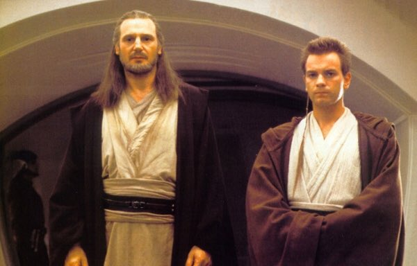
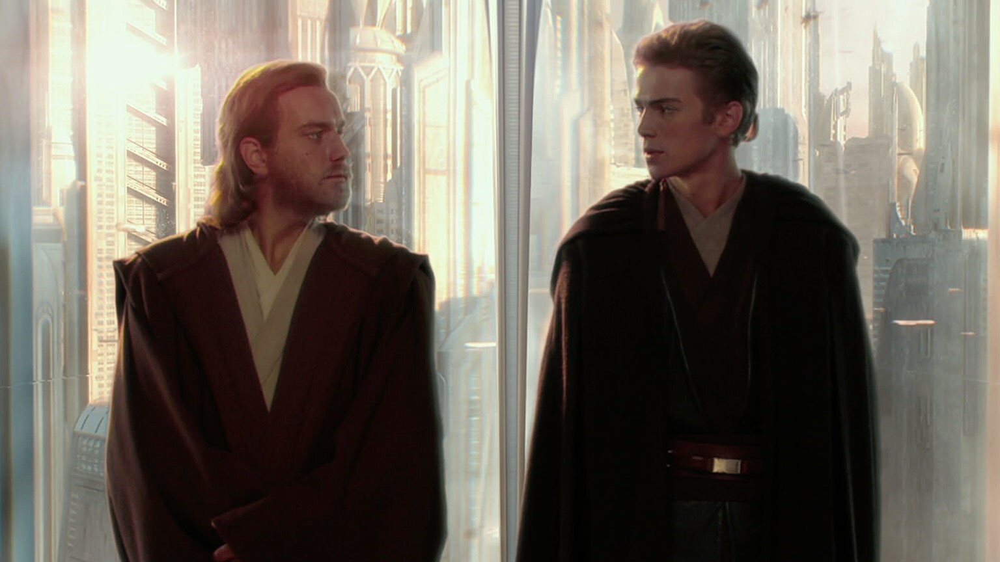
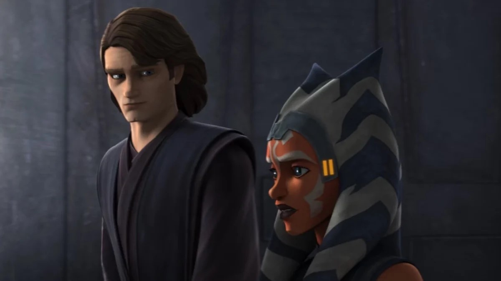
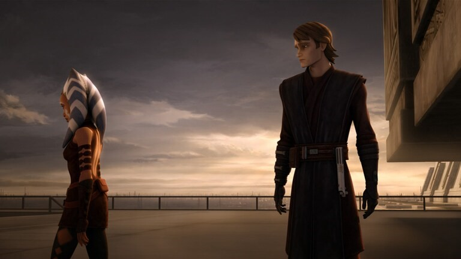

======================================================
Master and Padawan
======================================================

Qui-Gon Jinn & Obi-Wan Kenobi
======================================================

Qui-Gon Jinn and Obi-Wan Kenobi share a significant and pivotal relationship in the Star Wars saga. Their bond is explored in "Star Wars: Episode I - The Phantom Menace," which is the first installment in the prequel trilogy.

   Qui-Gon Jinn (on left) and Obi-Wan Kenobi (on right)

Master and Apprentice Dynamic
---------------------------------------------------------------------
The Master-Apprentice relationship is a traditional and fundamental aspect of the Jedi Order. Qui-Gon is portrayed as a wise and somewhat unconventional Jedi who often follows his instincts and the will of the Force, even if it means going against the Jedi Council's directives. Obi-Wan, as the apprentice, respects Qui-Gon but is also mindful of the Jedi Code and the Council's authority.

Differences in Approach
----------------------------------------------------------------------
Qui-Gon and Obi-Wan have different approaches to the Force and the Jedi way. Qui-Gon is more attuned to the living Force and is open to unconventional methods. He believes in following the will of the Force, even if it means challenging the Jedi Council. Obi-Wan, while respectful of Qui-Gon, tends to adhere more closely to the Jedi Code and Council decisions.

Discovery of Anakin Skywalker
----------------------------------------------------------------------
One of the pivotal moments in their relationship occurs when Qui-Gon discovers Anakin Skywalker on Tatooine. Qui-Gon senses the boy's strong connection to the Force and believes him to be the Chosen One destined to bring balance to the Force. Despite the Jedi Council's reservations, Qui-Gon is determined to train Anakin as a Jedi, and this decision sets the stage for future events.

Qui-Gon's Influence on Obi-Wan
------------------------------------------------------------------------
Qui-Gon's teachings and beliefs leave a lasting impact on Obi-Wan. Even after Qui-Gon's death at the hands of Darth Maul, Obi-Wan carries on his master's commitment to training Anakin. Qui-Gon's emphasis on following the will of the Force and his belief in Anakin's potential continue to shape Obi-Wan's decisions and actions throughout the prequel trilogy.

Legacy and Reflections
-------------------------------------------------------------------
Qui-Gon's influence is felt beyond his physical presence in the films. In "Star Wars: The Clone Wars" animated series, Qui-Gon's voice is heard communicating with Yoda, emphasizing the continued existence of a Jedi's consciousness after death. This concept adds a spiritual dimension to the Jedi philosophy and underscores Qui-Gon's unique connection to the Force.

The relationship between Qui-Gon Jinn and Obi-Wan Kenobi is a crucial element in the broader Star Wars narrative, influencing the characters' development and the events that unfold, particularly in the prequel trilogy.

Obi-Wan Kenobi & Anakin Skywalker
=====================================================

The relationship between Obi-Wan Kenobi and Anakin Skywalker is a central and complex element in the Star Wars saga, particularly in the prequel trilogy.

   Obi-Wan Kenobi (on left) and Anakin Skywalker (on right)

Master and Apprentice
---------------------------------------------------------------------
Obi-Wan becomes the Jedi Master to Anakin after the death of Qui-Gon Jinn. The Master-Apprentice relationship is a crucial aspect of Jedi training, and Obi-Wan takes on the responsibility of guiding Anakin's development as a Jedi.

Anakin's Training
-----------------------------------------------------------------------
Anakin is discovered by Qui-Gon Jinn, who believes he is the Chosen One destined to bring balance to the Force. Despite the Jedi Council's reservations, Obi-Wan follows his late master's wishes and trains Anakin. The training process, however, is challenging due to Anakin's strong emotions, impulsive nature, and the fear that he harbors.

Brotherly Bond
-------------------------------------------------------------------------
Over the years, Obi-Wan and Anakin develop a brotherly bond. Despite their differences, they share a deep mutual respect and affection. Obi-Wan becomes not just a mentor but also a friend to Anakin. This bond is evident in their interactions and shared experiences throughout "Star Wars: Episode II - Attack of the Clones" and "Star Wars: Episode III - Revenge of the Sith."

Challenges and Tensions
--------------------------------------------------------------------------
Anakin's inner struggles, fear of loss, and desire for power create tensions in the relationship. Anakin often feels constrained by the Jedi Code and the Council's rules, and he perceives Obi-Wan as holding him back. This strain on their bond is exacerbated by external factors, such as Anakin's secret marriage to Padmé Amidala and his visions of her death.

Anakin's Fall to the Dark Side
---------------------------------------------------------------------------
The turning point in their relationship comes in "Revenge of the Sith" when Anakin falls to the dark side of the Force and becomes Darth Vader. Manipulated by Emperor Palpatine (Darth Sidious), Anakin turns against the Jedi, including Obi-Wan. The emotional duel on the volcanic planet of Mustafar is a heartbreaking moment, with Obi-Wan expressing his deep disappointment and sadness at Anakin's choices.

Legacy and Redemption
-----------------------------------------------------------------------
Despite the tragic events that lead to Anakin's transformation into Darth Vader, there is a glimmer of hope in the belief that there is still good in him. Obi-Wan, Yoda, and later, Luke Skywalker, believe in Anakin's potential for redemption. This theme is further explored in the original trilogy.

The relationship between Obi-Wan Kenobi and Anakin Skywalker is a central narrative thread in the Star Wars prequel trilogy. It explores themes of friendship, mentorship, betrayal, and the consequences of choices, laying the groundwork for the iconic characters they become in the original trilogy.

Anakin Skywalker & Ahsoka Tano
=====================================================

The relationship between Anakin Skywalker and Ahsoka Tano is a significant and deeply personal aspect of the Star Wars animated series "Star Wars: The Clone Wars." Ahsoka Tano is introduced as Anakin's Padawan (apprentice) in the series, and their dynamic plays a crucial role in the development of both characters.

   Anakin Skywalker (on left) and  Ahsoka Tano (on right)

Master and Apprentice
------------------------------------------------------------------------
Anakin Skywalker is assigned a Padawan learner by the Jedi Council, and that Padawan is Ahsoka Tano. At first, Anakin is somewhat reluctant to take on the responsibility, but over time, he develops a strong bond with Ahsoka. Their relationship echoes the one between Anakin and Obi-Wan Kenobi, with Ahsoka being a headstrong and independent apprentice.

Mutual Growth
--------------------------------------------------------------------------
Ahsoka starts as a young and inexperienced Jedi, eager to prove herself. Anakin, in turn, learns patience and responsibility as he takes on the role of mentor. Throughout the series, both characters undergo significant growth. Ahsoka becomes a skilled and capable Jedi, and Anakin learns to balance his attachment to his Padawan with the demands of the war

Shared Experiences
------------------------------------------------------------------------------
Anakin and Ahsoka share many adventures and battles during the Clone Wars. These shared experiences strengthen their bond, and Anakin becomes a mentor and father figure to Ahsoka. They develop a level of trust and understanding that goes beyond the typical Master-Apprentice relationship.

Ahsoka's Departure
---------------------------------------------------------------------------

One of the most emotional moments in their relationship occurs when Ahsoka is falsely accused of a bombing and decides to leave the Jedi Order. Despite Anakin's efforts to prove her innocence, Ahsoka feels betrayed by the Jedi Council and chooses to walk away. This departure is a heartbreaking moment for both characters, as Anakin struggles with the loss of his Padawan.

   Anakin Skywalker (on right) and  Ahsoka Tano (on left)

Reunion in "Star Wars Rebels"
---------------------------------------------------------------------
Ahsoka's story continues beyond "The Clone Wars" in "Star Wars Rebels," where she encounters Darth Vader, who is now the fallen Anakin Skywalker. Ahsoka senses a familiar presence in Vader and eventually discovers his true identity. This reunion is a poignant and emotional moment, as Ahsoka comes face to face with the person Anakin has become.

Impact on Anakin's Character
----------------------------------------------------------------------
Ahsoka's departure and the events that follow contribute to Anakin's growing disillusionment with the Jedi Order and its leadership. The loss of Ahsoka is a personal and symbolic turning point in Anakin's journey toward the dark side of the Force.

The relationship between Anakin Skywalker and Ahsoka Tano adds depth and emotional resonance to the broader Star Wars narrative. Their bond explores themes of mentorship, loyalty, and the personal toll of war on individuals within the Jedi Order
